small change

## Folder Structure

```bash
.
├── 01-Perceptron
├── 02-ADALINE
├── 03-MLPRegressor
├── 04-MLPClassifier
├── .gitignore
├── LICENSE
└── README.md
```

## <u> Neural Network Foundations </u>

This repository contains implementations and explanations of different neural network algorithms.

Each neural network implementation in this repository comes with detailed explanations and code samples.

For a detailed exploration of each algorithm, refer to the corresponding folders in this directory.

### 01-Perceptron

The Perceptron is a fundamental neural network model for solving linearly seperable problems. This neural network architecture was developed in the late 1950's and is characterized by having weighted inputs and a threshold activation function. Another key feature is its decision boundary, a line, that is fast and reliable for the class of problems it can solve. A key limitation of this architecture, as evidence by the XOR problem, is, as hinted previously, its inability to solve problems that are not linearly seperable.

#### $\underline{Forwardpropagation}:$
#### $\vec{n} = W \cdot \vec{p} + \vec{b}$
#### $\vec{a} = hardlim(\vec{n})$

* $\vec{p}$: The input vector.
* $W$: The weight matrix.
* $\vec{b}$: The bias vector.
* $\vec{n}$: The net input vector.
* $hardlim()$: The hardlim activation function.
* $\vec{a}$: The output vector.

#### $\underline{Weight \ updates}:$
#### $W^{new} = W^{old} + \vec{e} \cdot \vec{p}^T$
#### $\vec{b}^{new} = \vec{b}^{old} + \vec{e}$
#### $where \ \vec{e} = \vec{t} - \vec{a}$

* $W^{old}$: The old weight matrix.
* $W^{new}$: The new weight matrix.
* $\vec{b}^{old}$: The old bias vector.
* $\vec{b}^{new}$: The new bias vector.
* $\vec{t}$: The target vector.
* $\vec{e}$: The error vector.

<table>
  <tr>
    <td style="width: 50%;">
      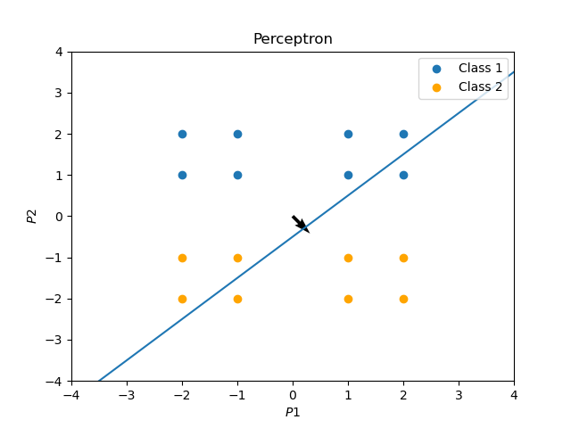
    </td>
    <td style="width: 50%;">
      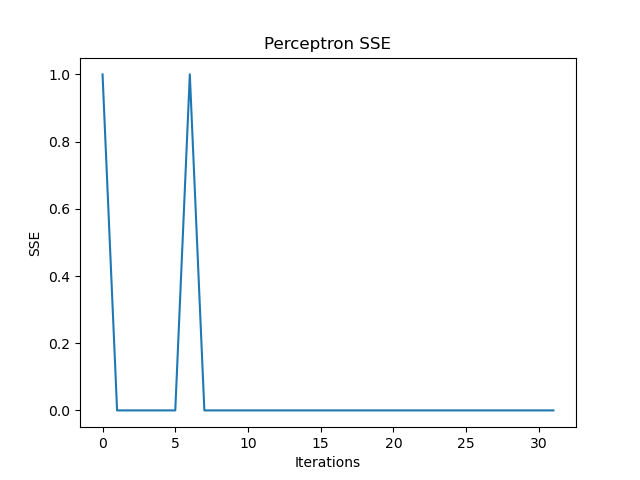
    </td>
  </tr>
  <tr>
    <td style="width: 50%;">
      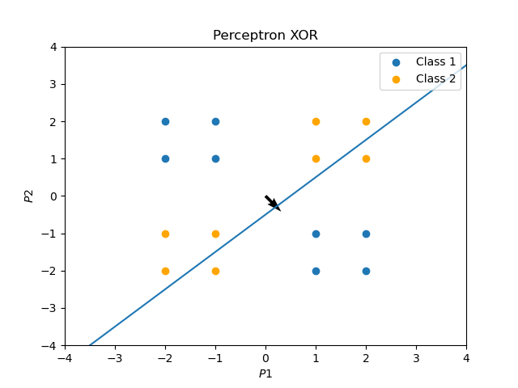
    </td>
    <td style="width: 50%;">
      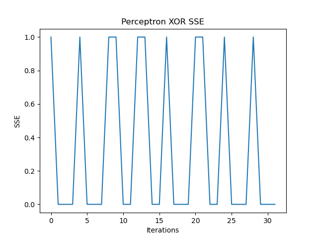
    </td>
  </tr>
</table>

### 02-ADALINE (Adaptive Linear Neuron)

ADALINE is a significant improvement over the Perceptron, as it utilizes a continuous activation function and an adaptive weight adjustment mechanism embedded with the Least Mean Squares (LMS) algorithm. However, the ADALINE still faces the same difficulties as the perceptron given that it cannot solve problems that are not linearly seperable.

#### $\underline{Forwardpropagation}:$
#### $\vec{a} = purelin(W \cdot \vec{p} + \vec{b})$

* $\vec{p}$: The input vector.
* $W$: The weight matrix.
* $\vec{b}$: The bias vector.
* $purelin()$: The purelin activation function.
* $\vec{a}$: The output vector.

#### $\underline{Weight \ updates}:$
#### $W_{k+1} = W_{k} - 2 \alpha \vec{e}_{k} \cdot \vec{p}_{k}^T$
#### $\vec{b}_{k+1} = \vec{b}_{k} - 2 \alpha \vec{e}_{k}$

* $W_{k}$: The weight matrix at iteration $k$.
* $W_{k+1}$: The weight matrix at iteration $k+1$.
* $\alpha$: The learning rate.
* $\vec{b}_{k}$: The bias vector at iteration $k$.
* $\vec{b}_{k+1}$: The bias vector at iteration $k+1$.
* $\vec{e}$: The error vector at iteration $k$.

<table>
  <tr>
    <td style="width: 50%;">
      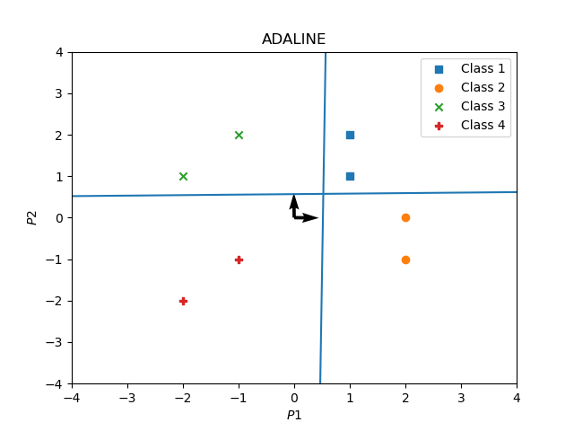
    </td>
    <td style="width: 50%;">
      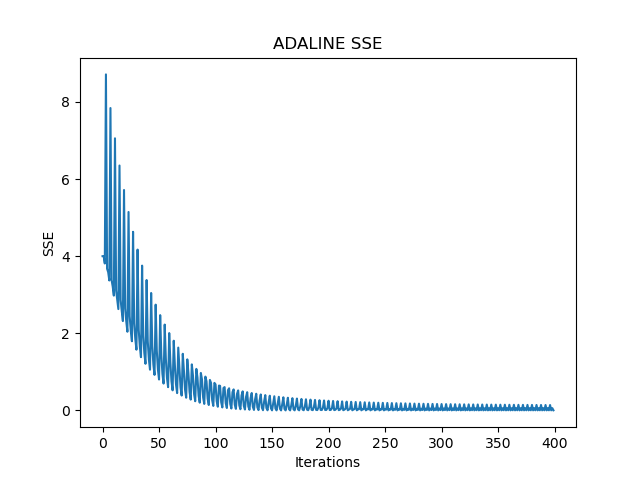
    </td>
  </tr>
</table>

### 03-MLPRegressor (Multi-Layer Perceptron Regressor)

The MLP Regressor's purpose is to serve as a function approximator. The main objective of this neural network architecture is to find an objective function that maps the inputs to its corresponding outputs. In this example, the controlled objective function of the target outputs is $f(x) = 1 + sin(\\frac{\pi}{4}x)$ and the function of the MLP regressor is to approximate such by adjusting its weights and biases correspondingly.

#### $\underline{Forwardpropagation}:$
#### $\vec{a}^0 = \vec{p}$
#### $\vec{a}^{m+1} = f^{m+1}(W^{m+1} \cdot \vec{a}^m + \vec{b}^{m+1})\ for \ m = 0, 1, ..., M-1$
#### $\vec{a} = \vec{a}^M$

* $\vec{p}$: The input vector.
* $\vec{a}^m$: The output vector of layer $m$.
* $W^{m+1}$: The weight matrix of layer $m+1$.
* $\vec{b}^{m+1}$: The bias vector of layer $m+1$.
* $f^{m+1}()$: The activation function of layer $m+1$.
* $\vec{a}$: The output vector.

#### $\underline{Backpropagation}:$
#### $s^{M} = F^{M} \cdot (\vec{n}^{M}) \cdot \vec{e}$
#### $s^{m} = F^{m} \cdot (\vec{n}^{m}) \cdot (W^{m+1^{T}}) \cdot s^{m+1} \ for \ m = M-1, ..., 2, 1$

* $s^{M}$: The sensitivity of output layer.
* $F^{M}$: The derivative of the activation function of output layer.
* $\vec{n}^{M}$: The input vector of output layer.
* $\vec{e}$: The error vector.
* $s^{m}$: The sensitivity of layer $m$.
* $F^{m}$: The derivative of the activation function of layer $m$.
* $\vec{n}^{m}$: The input vector of layer $m$.
* $W^{m+1^{T}}$: The weight matrix of layer $m+1$ transposed.
* $s^{m+1}$: The sensitivity of layer $m+1$.

#### $\underline{Weight \ updates}:$
#### $W_{k+1}^m = W_{k}^m - \alpha s^m \cdot (\vec{a}^{{m-1}^T})$
#### $\vec{b}_{k+1}^m = \vec{b}_{k}^m - \alpha s^m$

* $W_{k}^m$: The weight matrix of layer $m$ at iteration $k$.
* $W_{k+1}^m$: The weight matrix of layer $m$ at iteration $k+1$.
* $s^m$: The sensitivity of layer $m$.
* $\vec{a}^{{m-1}^T}$: The output of layer $m-1$ transposed.
* $\alpha$: The learning rate.
* $\vec{b}_{k}^m$: The bias vector of layer $m$ at iteration $k$.
* $\vec{b}_{k+1}^m$: The bias vector of layer $m$ at iteration $k+1$.

<table>
  <tr>
    <td style="width: 50%;">
      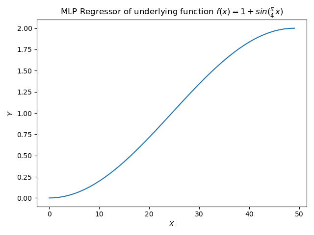
    </td>
    <td style="width: 50%;">
      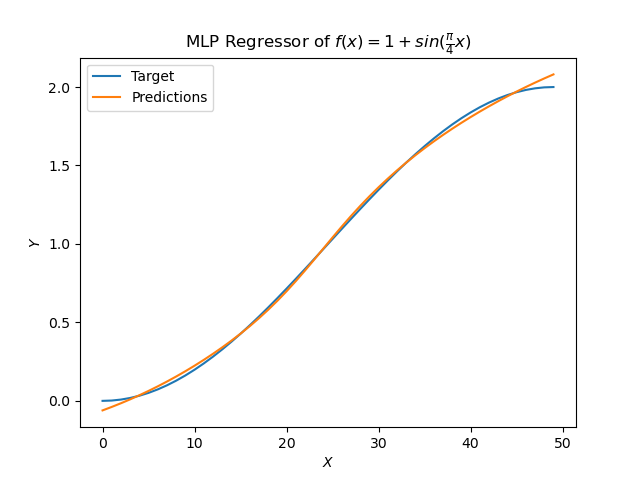
    </td>
  </tr>
  <tr>
    <td style="width: 100%;">
      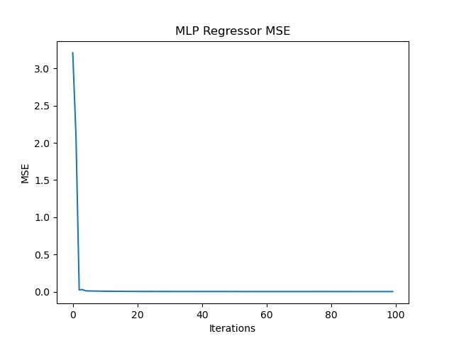
    </td>
  </tr>
</table>

### 04-MLPClassifier (Multi-Layer Perceptron Classifier)

The MLP Classifier's purpose is to identify underlying patterns, or representations, from inputs and classify their corresponding target values correctly. One fundamental characteristic of this neural network architecture is the $softmax()$ activation function of the output layer. This activation function is useful for classification problems given that it exponentiates and normalizes target outputs to create a probability distribution for the target classes. In this example, the number of classes is $10$ (number of digits), and the function of the MLP Classifier is to learn the underlying representations to accurately classify each input to its corresponding target class.

#### $\underline{Forwardpropagation}:$
#### $\vec{a}^0 = \vec{p}$
#### $\vec{a}^{m+1} = f^{m+1}(W^{m+1} \cdot \vec{a}^m + \vec{b}^{m+1}) \ for \ m = 0, 1, ..., M-2$
#### $\vec{a}^M = softmax(W^{m+1} \cdot \vec{a}^{M-1} + \vec{b}^{m+1})\ for \ m = M-1$
#### $\vec{a} = \vec{a}^M$

* $\vec{p}$: The input vector.
* $\vec{a}^m$: The output vector of layer $m$.
* $W^{m+1}$: The weight matrix of layer $m+1$.
* $\vec{b}^{m+1}$: The bias vector of layer $m+1$.
* $f^{m+1}()$: The activation function of layer $m+1$.
* $\vec{a}^{M-1}$: The output vector of output layer $M-1$.
* $softmax()$: The softmax activation function.
* $\vec{a}$: The output vector.

#### $\underline{Backpropagation}:$
#### $s^{M} = \vec{a} - \vec{t}$
#### $s^{m} = F^{m} \cdot (n^{m}) \cdot (W^{m+1^{T}}) \cdot s^{m+1} \ for \ m = M-1, ..., 2, 1$

* $s^{M}$: The sensitivity of output layer.
* $\vec{t}$: The target class vector.
* $\vec{e}$: The error vector.
* $s^{m}$: The sensitivity of layer $m$.
* $F^{m}$: The derivative of the activation function of layer $m$.
* $\vec{n}^{m}$: The input vector of layer $m$.
* $W^{m+1^{T}}$: The weight matrix of layer $m+1$ transposed.
* $s^{m+1}$: The sensitivity of layer $m+1$.

#### $\underline{Weight \ updates}:$
#### $W_{k+1}^m = W_{k}^m - \alpha s^m \cdot (\vec{a}^{{m-1}^T})$
#### $\vec{b}_{k+1}^m = \vec{b}_{k}^m - \alpha s^m$

* $W_{k}^m$: The weight matrix of layer $m$ at iteration $k$.
* $W_{k+1}^m$: The weight matrix of layer $m$ at iteration $k+1$.
* $s^m$: The sensitivity of layer $m$.
* $\vec{a}^{{m-1}^T}$: The output of layer $m-1$ transposed.
* $\alpha$: The learning rate.
* $\vec{b}_{k}^m$: The bias vector of layer $m$ at iteration $k$.
* $\vec{b}_{k+1}^m$: The bias vector of layer $m$ at iteration $k+1$.

<table>
  <tr>
    <td style="width: 50%;">
      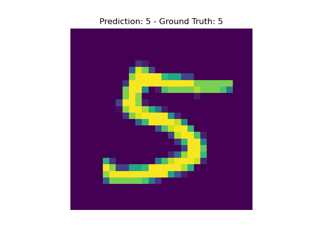
    </td>
    <td style="width: 50%;">
      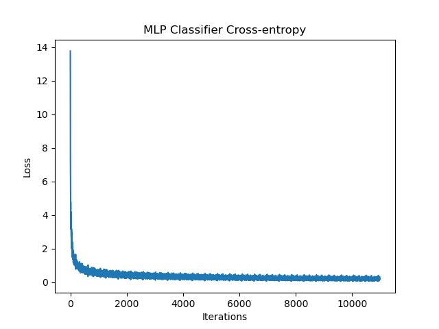
    </td>
  </tr>
</table>

## References 

Oklahoma State University–Stillwater. (n.d.). https://hagan.okstate.edu/NNDesign.pdf 

## Usage

Each subdirectory contains its own set of implementations and explanatory notes. To explore the implementations and learn more about each concept, navigate to the respective subdirectory's README.md file.

Feel free to explore, experiment, and contribute to this open source project.
